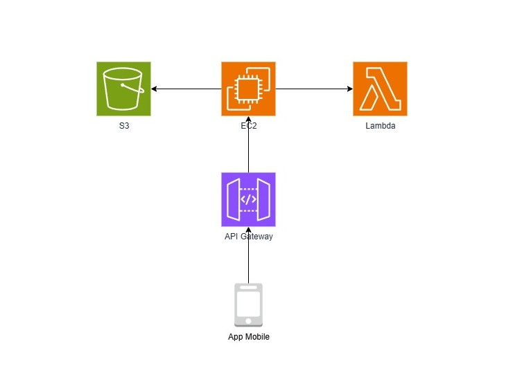

## 🗂 Desafio 01 - Gerenciamento de Instâncias EC2 na AWS

### Objetivo
Este desafio consolida meus conhecimentos sobre **computação em nuvem**, **arquitetura de back-end** e **integração de serviços AWS**.  
>Além disso, permite praticar a criação, configuração e gerenciamento de instâncias **EC2** na AWS, integradas com **Lambda**, **API Gateway** e **S3**, simulando a arquitetura de um backend simples para um app que calcula rotas e custos de deslocamento.

### Diagrama da Arquitetura
O diagrama abaixo ilustra visualmente a arquitetura do back-end:

### Componentes Principais

| Componente          | Serviço AWS    | Função / Porquê                                                                 |
|--------------------|---------------|-------------------------------------------------------------------------------|
| **App Mobile**      | —             | Interface do usuário. Envia dados de origem/destino e recebe resultados.      |
| **API Gateway**     | API Gateway   | Porta de entrada da API. Roteia requisições para EC2 ou Lambda, simplificando o acesso externo. |
| **Backend / API**   | EC2           | Hospeda a API principal em Spring Boot. Processa as requisições do app.       |
| **Serviços Modulares** | Lambda     | Funções independentes para cálculos de custo, tempo e rota. Modulariza a lógica sem sobrecarregar o EC2. |
| **Armazenamento**   | S3            | Guarda arquivos estáticos (mapas, imagens, assets). Fácil acesso e barato.    |

### Fluxo de Comunicação

1. O usuário envia dados pelo **App Mobile**.  
2. O **API Gateway** recebe a requisição e envia para o **EC2**.  
3. O **EC2** processa a lógica principal e, se necessário, chama **Lambda** para funções específicas.  
4. O **Lambda** retorna os resultados para o EC2.  
5. O **EC2** acessa o **S3** se precisar de arquivos/assets.  
6. O resultado final é enviado de volta para o **App Mobile** via **API Gateway**.

### Aprendizados do Projeto
- Criar e configurar instâncias **EC2**.  
- Modularizar funções com **Lambda**.  
- Roteamento de requisições externas com **API Gateway**.  
- Armazenamento e acesso a arquivos em **S3**.  
- Documentação de arquitetura simples na AWS.